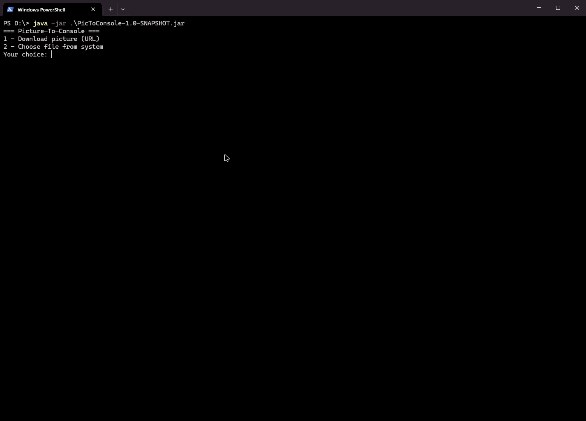

# picture-to-console

Simple, lightweight Java console application that takes any image and renders it directly in your terminal using ANSI colored blocks. 

## 🖼️ Demonstration


## ✨ Features
* **Two Input Methods:**
  * Select an image from your computer using a native OS file picker (Swing `JFileChooser`).
  * Download and render an image directly from a URL.
* **Customizable Resolution:** You decide the width of the console output. The program automatically calculates the correct aspect ratio.
* **True Color Support:** Uses ANSI escape codes to render true RGB colors in supported terminals.

## 🚀 How to Run

### Prerequisites
* Java 11 or higher (Make sure your terminal supports ANSI color codes).
* Maven (for building the project).

### Build & Execute
1. Clone the repository:
   ```bash
   git clone [https://github.com/your-username/PicToConsole.git](https://github.com/your-username/PicToConsole.git)
